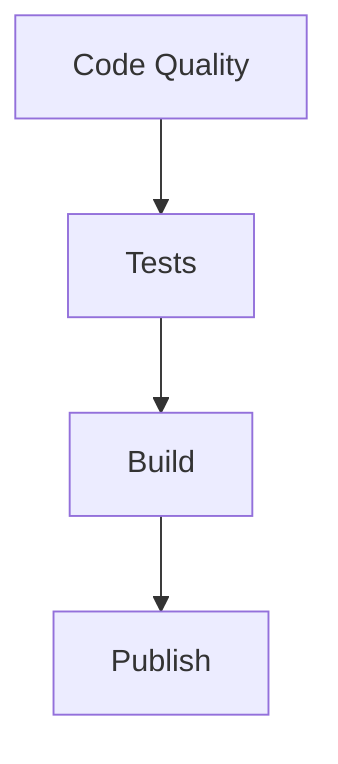

# Main Workflow Configuration Documentation

## File: `.github/workflows/main.yml`

This file defines the main GitHub Actions workflow that orchestrates the entire CI/CD pipeline.

## Configuration Details

### Workflow Name
```yaml
name: Main Workflow
```
The workflow is named "Main Workflow" and serves as the primary orchestration point for all CI/CD activities.

### Trigger Configuration
```yaml
on:
  push:
    branches:
      - "**"
```
- Triggers on any push to any branch
- The `"**"` pattern matches all branches in the repository
- This ensures comprehensive coverage of all code changes

### Job Structure

#### 1. Code Quality Job
```yaml
code-quality:
  uses: ./.github/workflows/code-quality.yml
  with:
    ref: ${{ github.ref }}
```
- First job in the pipeline
- Uses reusable workflow from `code-quality.yml`
- Passes the current branch reference (`github.ref`)

#### 2. Tests Job
```yaml
tests:
  uses: ./.github/workflows/tests.yml
  needs: code-quality
  with:
    ref: ${{ github.ref }}
```
- Depends on successful completion of `code-quality`
- Uses reusable workflow from `tests.yml`
- Inherits the branch reference

#### 3. Build Job
```yaml
build:
  uses: ./.github/workflows/build.yml
  needs: tests
  with:
    ref: ${{ github.ref }}
```
- Depends on successful completion of `tests`
- Uses reusable workflow from `build.yml`
- Maintains branch reference consistency

#### 4. Publish Job
```yaml
publish:
  permissions:
    security-events: write
    actions: read
    contents: write
  if: ${{ success() }}
  needs: build
  uses: ./.github/workflows/publish.yml
  with:
    ref: ${{ github.ref }}
  secrets:
    DOCKER_USER: ${{ secrets.DOCKER_USER }}
    DOCKER_PASSWORD: ${{ secrets.DOCKER_PASSWORD }}
    COSIGN_KEY: ${{ secrets.COSIGN_KEY }}
    COSIGN_PASSWORD: ${{ secrets.COSIGN_PASSWORD }}
```
- Conditional execution based on previous job success
- Requires specific permissions for security and publishing
- Passes necessary secrets for Docker and Cosign operations
- Depends on successful completion of `build`

## Security Considerations

### Required Permissions
- `security-events: write` - For security event logging
- `actions: read` - For private repository access
- `contents: write` - For artifact publishing

### Required Secrets
The following secrets must be configured in the repository:
1. `DOCKER_USER` - Docker registry authentication
2. `DOCKER_PASSWORD` - Docker registry authentication
3. `COSIGN_KEY` - Artifact signing key
4. `COSIGN_PASSWORD` - Signing key protection

## Workflow Dependencies



## Best Practices for Maintenance

1. **Secret Management**
   - Regularly rotate all secrets
   - Use repository-level secrets
   - Follow least-privilege principle

2. **Workflow Updates**
   - Keep reusable workflows up to date
   - Test changes in a development branch
   - Document any modifications

3. **Security**
   - Regularly audit permissions
   - Monitor security events
   - Review access patterns

## Common Issues and Solutions

1. **Permission Denied**
   - Verify repository settings
   - Check secret configurations
   - Review GitHub Actions permissions

2. **Workflow Failures**
   - Check individual job logs
   - Verify dependencies
   - Ensure all secrets are configured

3. **Build Issues**
   - Review build environment
   - Check resource limits
   - Verify artifact paths

## Support and Resources

- GitHub Actions Documentation: [https://docs.github.com/en/actions](https://docs.github.com/en/actions)
- Docker Documentation: [https://docs.docker.com](https://docs.docker.com)
- Cosign Documentation: [https://docs.sigstore.dev/cosign/overview/](https://docs.sigstore.dev/cosign/overview/) 
