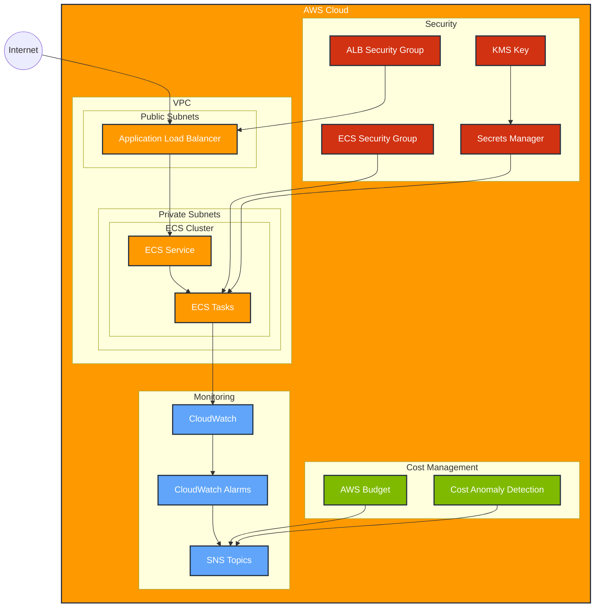
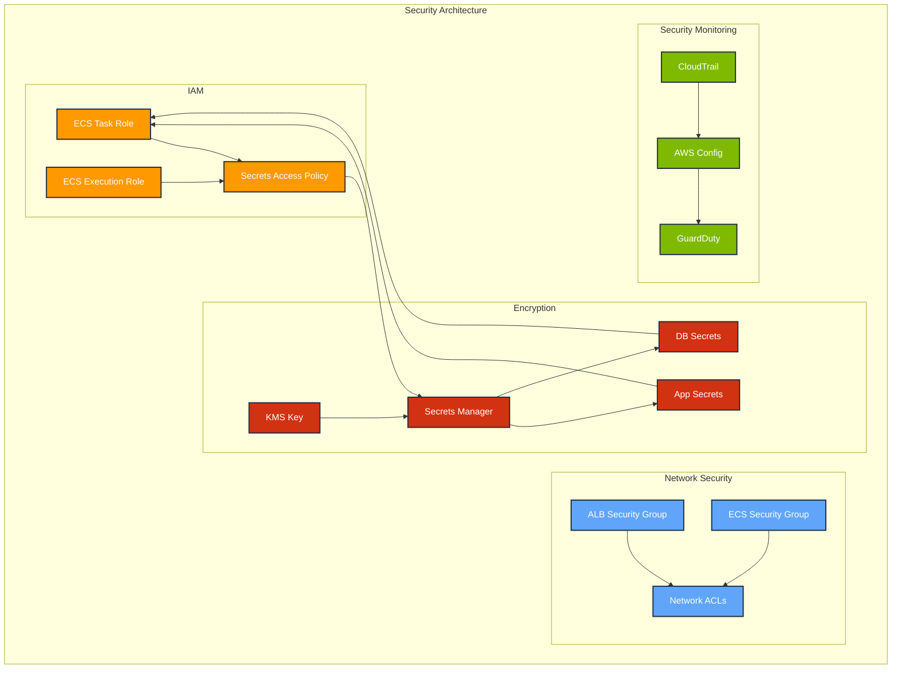
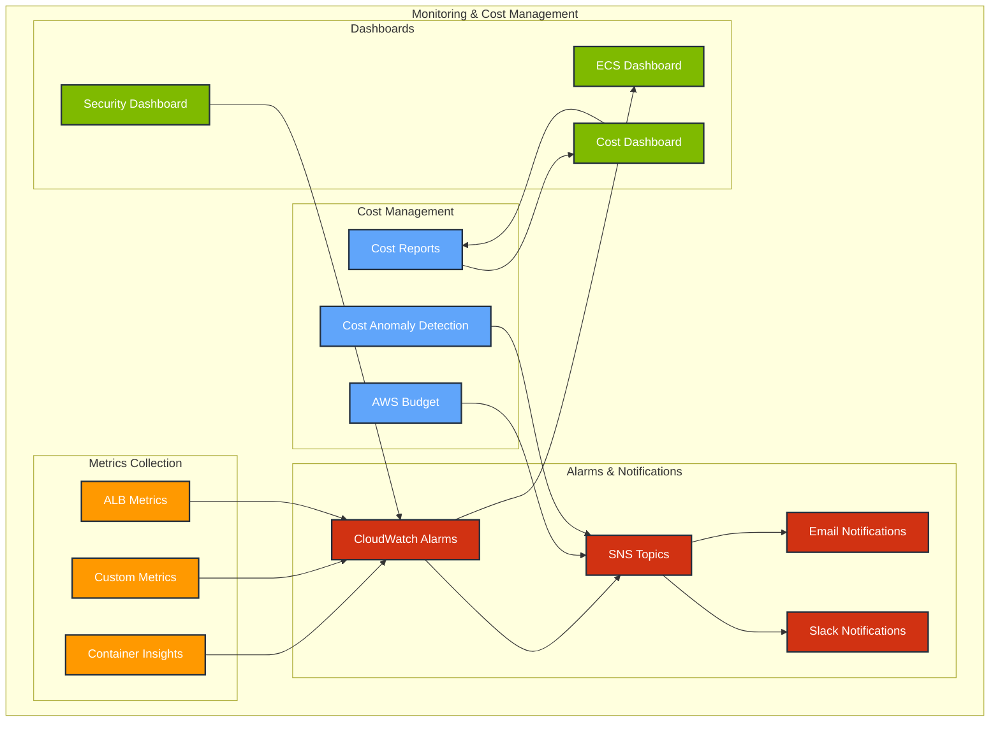

# Architecture Documentation

## System Architecture

```mermaid
graph TB
    subgraph AWS["AWS Cloud"]
        subgraph VPC["VPC"]
            subgraph Public["Public Subnets"]
                ALB["Application Load Balancer"]
            end
            
            subgraph Private["Private Subnets"]
                subgraph ECS["ECS Cluster"]
                    Service["ECS Service"]
                    Task["ECS Tasks"]
                end
            end
        end

        subgraph Security["Security"]
            SG_ALB["ALB Security Group"]
            SG_ECS["ECS Security Group"]
            KMS["KMS Key"]
            Secrets["Secrets Manager"]
        end

        subgraph Monitoring["Monitoring"]
            CloudWatch["CloudWatch"]
            Alarms["CloudWatch Alarms"]
            SNS["SNS Topics"]
        end

        subgraph Cost["Cost Management"]
            Budget["AWS Budget"]
            Anomaly["Cost Anomaly Detection"]
        end
    end

    %% Connections
    Internet((Internet)) --> ALB
    ALB --> Service
    Service --> Task
    
    %% Security connections
    SG_ALB --> ALB
    SG_ECS --> Task
    KMS --> Secrets
    Secrets --> Task
    
    %% Monitoring connections
    Task --> CloudWatch
    CloudWatch --> Alarms
    Alarms --> SNS
    
    %% Cost connections
    Budget --> SNS
    Anomaly --> SNS

    %% Styling
    classDef aws fill:#FF9900,stroke:#232F3E,stroke-width:2px,color:white
    classDef security fill:#D13212,stroke:#232F3E,stroke-width:2px,color:white
    classDef monitoring fill:#60A5FA,stroke:#232F3E,stroke-width:2px,color:white
    classDef cost fill:#7FBA00,stroke:#232F3E,stroke-width:2px,color:white
    
    class AWS,ALB,Service,Task aws
    class SG_ALB,SG_ECS,KMS,Secrets security
    class CloudWatch,Alarms,SNS monitoring
    class Budget,Anomaly cost
```

## Security Architecture

```mermaid
graph TB
    subgraph Security["Security Architecture"]
        subgraph IAM["IAM"]
            TaskRole["ECS Task Role"]
            ExecRole["ECS Execution Role"]
            SecretsPolicy["Secrets Access Policy"]
        end

        subgraph Encryption["Encryption"]
            KMS["KMS Key"]
            Secrets["Secrets Manager"]
            AppSecrets["App Secrets"]
            DBSecrets["DB Secrets"]
        end

        subgraph Network["Network Security"]
            SG_ALB["ALB Security Group"]
            SG_ECS["ECS Security Group"]
            NACL["Network ACLs"]
        end

        subgraph Monitoring["Security Monitoring"]
            CloudTrail["CloudTrail"]
            Config["AWS Config"]
            GuardDuty["GuardDuty"]
        end
    end

    %% IAM Connections
    TaskRole --> SecretsPolicy
    ExecRole --> SecretsPolicy
    SecretsPolicy --> Secrets

    %% Encryption Connections
    KMS --> Secrets
    Secrets --> AppSecrets
    Secrets --> DBSecrets
    AppSecrets --> TaskRole
    DBSecrets --> TaskRole

    %% Network Security
    SG_ALB --> NACL
    SG_ECS --> NACL

    %% Security Monitoring
    CloudTrail --> Config
    Config --> GuardDuty

    %% Styling
    classDef iam fill:#FF9900,stroke:#232F3E,stroke-width:2px,color:white
    classDef encryption fill:#D13212,stroke:#232F3E,stroke-width:2px,color:white
    classDef network fill:#60A5FA,stroke:#232F3E,stroke-width:2px,color:white
    classDef monitoring fill:#7FBA00,stroke:#232F3E,stroke-width:2px,color:white
    
    class TaskRole,ExecRole,SecretsPolicy iam
    class KMS,Secrets,AppSecrets,DBSecrets encryption
    class SG_ALB,SG_ECS,NACL network
    class CloudTrail,Config,GuardDuty monitoring
```

## Monitoring Architecture

```mermaid
graph TB
    subgraph Monitoring["Monitoring & Cost Management"]
        subgraph Metrics["Metrics Collection"]
            ContainerInsights["Container Insights"]
            CustomMetrics["Custom Metrics"]
            ALBMetrics["ALB Metrics"]
        end

        subgraph Alarms["Alarms & Notifications"]
            CloudWatch["CloudWatch Alarms"]
            SNS["SNS Topics"]
            Email["Email Notifications"]
            Slack["Slack Notifications"]
        end

        subgraph Cost["Cost Management"]
            Budget["AWS Budget"]
            Anomaly["Cost Anomaly Detection"]
            Reports["Cost Reports"]
        end

        subgraph Dashboards["Dashboards"]
            ECSDashboard["ECS Dashboard"]
            CostDashboard["Cost Dashboard"]
            SecurityDashboard["Security Dashboard"]
        end
    end

    %% Metrics Collection
    ContainerInsights --> CloudWatch
    CustomMetrics --> CloudWatch
    ALBMetrics --> CloudWatch

    %% Alarms & Notifications
    CloudWatch --> SNS
    SNS --> Email
    SNS --> Slack

    %% Cost Management
    Budget --> SNS
    Anomaly --> SNS
    Reports --> CostDashboard

    %% Dashboards
    CloudWatch --> ECSDashboard
    CostDashboard --> Reports
    SecurityDashboard --> CloudWatch

    %% Styling
    classDef metrics fill:#FF9900,stroke:#232F3E,stroke-width:2px,color:white
    classDef alarms fill:#D13212,stroke:#232F3E,stroke-width:2px,color:white
    classDef cost fill:#60A5FA,stroke:#232F3E,stroke-width:2px,color:white
    classDef dashboards fill:#7FBA00,stroke:#232F3E,stroke-width:2px,color:white
    
    class ContainerInsights,CustomMetrics,ALBMetrics metrics
    class CloudWatch,SNS,Email,Slack alarms
    class Budget,Anomaly,Reports cost
    class ECSDashboard,CostDashboard,SecurityDashboard dashboards
``` 